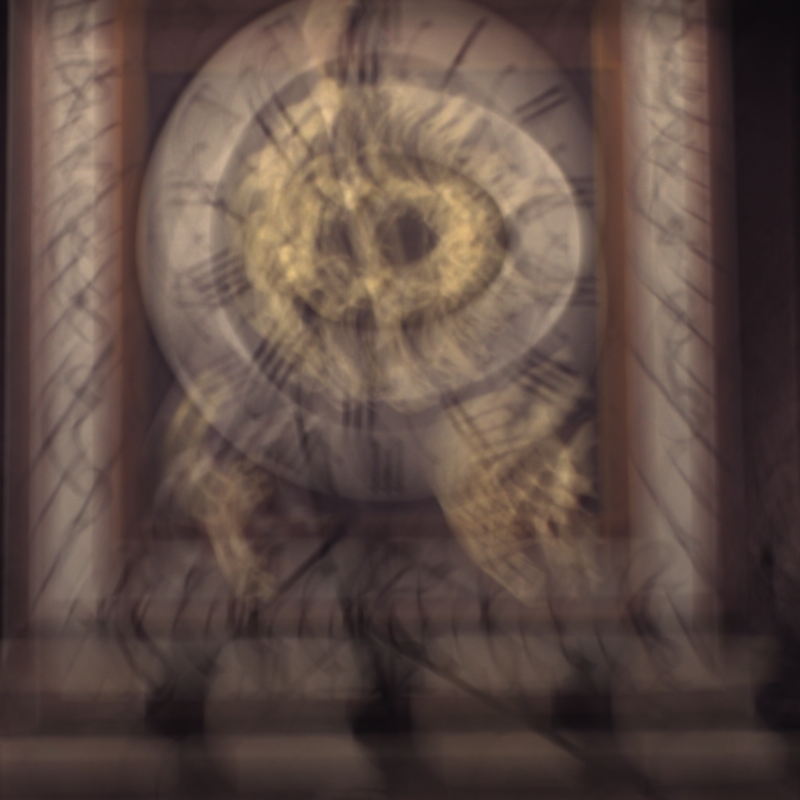
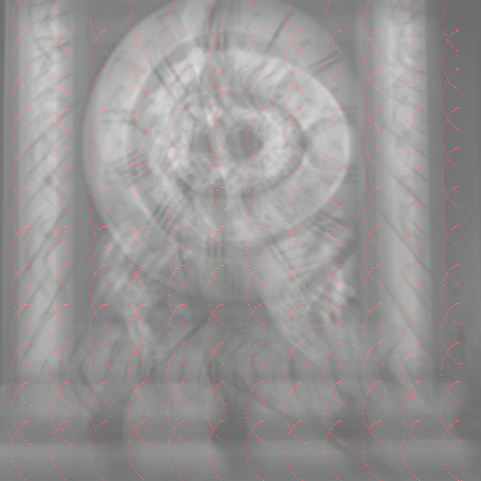
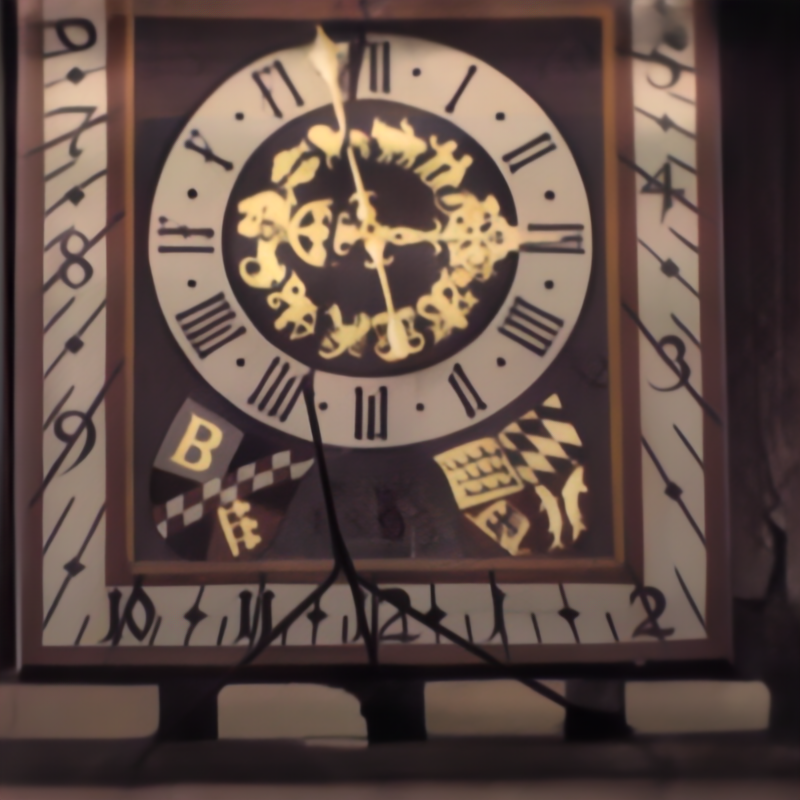

# Blur2Seq

Official Pytorch Implementation  of *Blur2Seq*. 
 

| **Blurry** | **Kernels** | **Blur2Seq** |
|:------------:|:------------:|:------------:|
|  |  |  |

## Trajectory Prediction Network Architecture
<p align="center">

  </p>
  
## Quick Demo


* <a href="https://colab.research.google.com/github/GuillermoCarbajal/Blur2Seq/blob/master/Blur2Seq_demo.ipynb" target="_parent"></a>

## Installation
### Clone Repository
```
git clone https://github.com/GuillermoCarbajal/Blur2Seq.git
```
### Install dependencies
```
conda create -n Blur2Seq python=3.8
conda activate Blur2Seq
pip install -r requirements.txt
```
### Download deblurring models

[Trajectory Prediction Network](https://iie.fing.edu.uy/~carbajal/Blur2Seq/camera_shake_epoch25_epoch35_epoch50_epoch10_epoch5_epoch25_epoch25_epoch25_epoch27_epoch24_epoch4_epoch10_epoch22_epoch23_epoch90.pkl)           
[Restoration Network](https://iie.fing.edu.uy/~carbajal/Blur2Seq/camera_shake_epoch25_epoch35_epoch50_epoch10_epoch5_epoch25_epoch25_epoch25_epoch27_epoch24_epoch4_epoch10_epoch22_epoch23_epoch90_G.pkl)

### Deblur an image or a list of images
```
python test_Blur2Seq.py -b blurry_img_path --reblur_model reblur_model_path --restoration_network restoration_model_path --output_folder results
```

### Parameters
Additional options:   
  `--blurry_image`: may be a singe image path or a .txt with a list of images.
  
  `--resize_factor`: input image resize factor (default 1)     
  
  `--focal_length`: given focal length. By default, it is assumed that f=max(H,W). For Kohler dataset images `f=3900`.
  

## Training Set Generation

We provide the code we used to generate the training set. The synthetic dataset is constructed using images from the [COCO](https://cocodataset.org/#download) dataset (Lin et al. (2014)), though
any other dataset of sharp images could be used.

```
python -m training_pairs_generation.generate_sample_training_paires -sf ./training_pairs_generation/sample_data/sharp -pf ./training_pairs_generation/sample_data/positions/ -o ./training_pairs_generation/sample_training_pairs
```


## Aknowledgments 
We thank the authors of [Deep Model-Based Super-Resolution with Non-Uniform Blur](https://arxiv.org/abs/2204.10109) for the Blind Deconvolution Network provided in https://github.com/claroche-r/DMBSR 


Guillermo Carbajal was supported partially by Agencia Nacional de Investigacion e Innovación (ANII, Uruguay) `grant POS FCE 2018 1 1007783`. The experiments presented in this paper were carried out using ClusterUY (site: https://cluster.uy).
